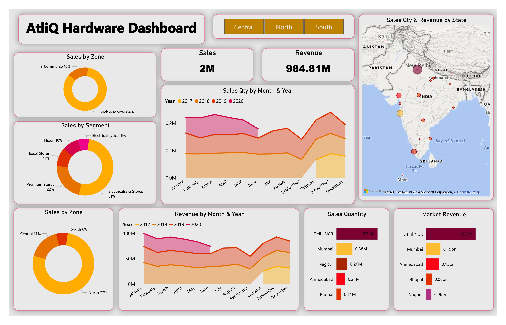

## AtliQ_Hardware_Sales_Insights
 

## Project Overview
The AtliQ Hardware Sales Insights project focuses on analyzing sales data for AtliQ Hardware, utilizing advanced data analytics techniques to derive actionable insights.

## Data Processing
The project employs SQL for data extraction and manipulation, enhancing the understanding of sales trends and patterns through effective data wrangling.

## Visualization and Analysis
A visual dashboard created with Power BI presents insights in a user-friendly format, allowing stakeholders to make informed decisions based on real-time visualizations of key sales metrics.

Conclusion
This project improves operational efficiency and strategic planning for the hardware business, offering a comprehensive analysis of sales data. Explore the repository for detailed documentation and files.